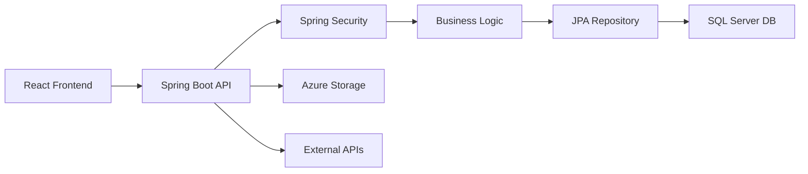

# 📋 Quản Lý Dự Án - Project Management
## Model Product Ordering System (D11_RT05)

Tài liệu này trả lời các câu hỏi về quản lý dự án: **Model triển khai**, **Công cụ quản lý**, và **Công nghệ sử dụng**.

---

## 🎯 1. MÔ HÌNH TRIỂN KHAI DỰ ÁN (Project Deployment Model)

### 1.1 Mô hình phát triển: **Agile/Scrum**
- **Sprint Planning**: Phát triển theo từng iteration/sprint
- **Iterative Development**: 
  - ✅ Iteration 1: Authentication, Product Browsing, Order Placement
  - 🛠️ Iteration 2: Staff/Inventory Management, Order Tracking  
  - 🔜 Iteration 3: Advanced Reporting, Deployment
- **Continuous Integration**: Maven build tự động
- **Feature-based Development**: Phát triển theo tính năng

### 1.2 Mô hình kiến trúc: **3-Tier Architecture**
```
┌─────────────────┐    ┌─────────────────┐    ┌─────────────────┐
│   Frontend      │◄──►│    Backend      │◄──►│    Database     │
│   (React.js)    │    │  (Spring Boot)  │    │  (SQL Server)   │
│   Presentation  │    │   Business      │    │      Data       │
│     Layer       │    │     Logic       │    │     Layer       │
└─────────────────┘    └─────────────────┘    └─────────────────┘
```

### 1.3 Mô hình triển khai: **Cloud-Native (Azure)**
- **Containerization**: Dockerfile cho Spring Boot app
- **Cloud Services**: Azure SQL Database, Azure Storage, Azure Key Vault
- **Microservices Pattern**: Tách biệt frontend/backend
- **Auto-scaling**: Azure App Service với load balancing

---

## 🛠️ 2. CÔNG CỤ QUẢN LÝ DỰ ÁN (Project Management Tools)

### 2.1 Quản lý mã nguồn (Source Control)
- **Git**: Version control system
- **GitHub**: Remote repository, collaboration platform
- **Branching Strategy**: Feature branches + Pull Requests
- **Code Review**: Mandatory PR reviews before merge

### 2.2 Quản lý build & dependencies
- **Maven**: Build automation tool (pom.xml)
- **Spring Boot Maven Plugin**: Application packaging
- **Dependency Management**: Maven Central Repository

### 2.3 IDE & Development Tools
- **Primary**: NetBeans IDE (Java development)
- **Secondary**: VS Code (Frontend + general editing)
- **Database Tools**: SQL Server Management Studio
- **API Testing**: Postman
- **Design**: Figma (UI/UX mockups)

### 2.4 Quản lý dự án & collaboration
- **GitHub Issues**: Bug tracking, feature requests
- **GitHub Projects**: Kanban board, milestone tracking
- **Pull Requests**: Code review, feature integration
- **GitHub Actions**: CI/CD pipeline (future implementation)

### 2.5 Testing & Quality Assurance
- **Unit Testing**: JUnit 5 (Spring Boot Test)
- **Integration Testing**: Spring Boot Test slices
- **Manual Testing**: Browser testing cho frontend
- **Code Quality**: Maven compiler warnings

---

## 💻 3. CÔNG NGHỆ SỬ DỤNG (Technology Stack)

### 3.1 Backend Technologies
```xml
Backend Framework: Spring Boot 3.2.5
├── Spring MVC: Web layer, REST APIs
├── Spring Data JPA: Database access layer  
├── Spring Security: Authentication & authorization
├── Spring OAuth2 Client: Google OAuth integration
└── Jakarta EE 10: Enterprise Java standard
```

**Dependencies chính:**
- **Java 11**: Programming language
- **Jakarta EE 10.0.0**: Enterprise Java platform
- **Spring Boot Starter Web**: REST API development
- **Spring Boot Starter Data JPA**: ORM với Hibernate
- **Spring Boot Starter Security**: Security framework
- **Spring Boot Starter OAuth2**: OAuth2 authentication

### 3.2 Database & Storage
```
Database: Microsoft SQL Server
├── Azure SQL Database: Cloud database service
├── MSSQL JDBC Driver: Database connectivity
├── JPA/Hibernate: ORM framework
└── H2 Database: In-memory testing database
```

### 3.3 Cloud & Infrastructure (Azure)
```
Azure Services:
├── Azure Storage Blob: File storage (images, documents)
├── Azure Key Vault: Secrets management
├── Azure Identity: Authentication service
├── Azure SQL Database: Managed database
└── Azure App Service: Application hosting
```

### 3.4 Frontend Technologies
```
Frontend Stack:
├── HTML5: Markup language
├── CSS3: Styling & responsive design
├── JavaScript ES6+: Client-side logic
├── React.js: Component-based UI framework
└── JSP + JSTL: Server-side rendering (backup)
```

**Frontend Dependencies:**
- **Tomcat Embed Jasper**: JSP compilation
- **Jakarta Servlet API**: Web servlet standard
- **JSTL (Jakarta)**: JSP Standard Tag Library

### 3.5 Authentication & Security
```
Authentication Stack:
├── Google OAuth2: Social login
├── Spring Security: Authorization framework
├── JWT Tokens: Stateless authentication
├── HTTPS: Secure communication
└── Azure AD: Enterprise authentication (future)
```

### 3.6 Development & Build Tools
```
Development Tools:
├── Maven 3.9.x: Build automation
├── Java 17: Runtime environment
├── Spring Boot DevTools: Hot reload
├── Spring Boot Actuator: Monitoring & health checks
└── Git: Version control
```

---

## 📊 4. KIẾN TRÚC HỆ THỐNG (System Architecture)

### 4.1 Luồng dữ liệu (Data Flow)


### 4.2 Phân quyền hệ thống (Role-based Access)
- **Customer**: Browse, order, review products
- **Staff**: Order management, inventory updates
- **Admin**: Full system access, user management, reports

### 4.3 Tích hợp bên ngoài (External Integrations)
- **Google OAuth API**: User authentication
- **VNPay API**: Payment processing
- **Azure Services**: Cloud infrastructure
- **Email Service**: Notifications (future)

---

## 🚀 5. QUY TRÌNH PHÁT TRIỂN (Development Workflow)

### 5.1 Git Workflow
```
1. Feature Branch: git checkout -b feature/new-feature
2. Development: Code + commit changes
3. Pull Request: Create PR for code review
4. Review: Team review + approval
5. Merge: Merge to main branch
6. Deploy: Automatic deployment to staging/production
```

### 5.2 Build & Test Process
```bash
# Local Development
mvn clean compile          # Compile source code
mvn test                  # Run unit tests
mvn spring-boot:run       # Run application locally

# Production Build
mvn clean package         # Create WAR file
mvn spring-boot:build-image # Create Docker image (future)
```

### 5.3 Deployment Strategy
- **Development**: Local development server
- **Staging**: Azure App Service (testing)
- **Production**: Azure App Service (live)
- **Database**: Azure SQL Database với backup tự động

---

## 📈 6. HIỆN TRẠNG VÀ KẾ HOẠCH (Current Status & Roadmap)

### 6.1 Tính năng đã hoàn thành
- ✅ Hệ thống authentication (Google OAuth)
- ✅ Quản lý sản phẩm (Product management)
- ✅ Giỏ hàng và đặt hàng (Cart & ordering)
- ✅ Đánh giá sản phẩm (Product reviews)
- ✅ Tích hợp Azure cloud services

### 6.2 Đang phát triển
- 🛠️ Quản lý kho hàng (Inventory management)
- 🛠️ Theo dõi đơn hàng (Order tracking)
- 🛠️ Dashboard quản trị (Admin dashboard)

### 6.3 Kế hoạch tương lai
- 🔜 Báo cáo và thống kê (Reporting system)
- 🔜 Mobile responsive design
- 🔜 API documentation (Swagger)
- 🔜 Automated testing suite
- 🔜 CI/CD pipeline với GitHub Actions

---

## 👥 7. TEAM VÀ LIÊN HỆ (Team & Contact)

**Developer**: tantkde180504@fpt.edu.vn  
**Supervisor**: [Lecturer's Name]  
**Repository**: https://github.com/tantkde180504/D11_RT05  
**Technology Stack**: Java Spring Boot + React.js + Azure Cloud  

---

*Tài liệu này cung cấp cái nhìn tổng quan về mô hình triển khai, công cụ quản lý và công nghệ được sử dụng trong dự án Model Product Ordering System.*